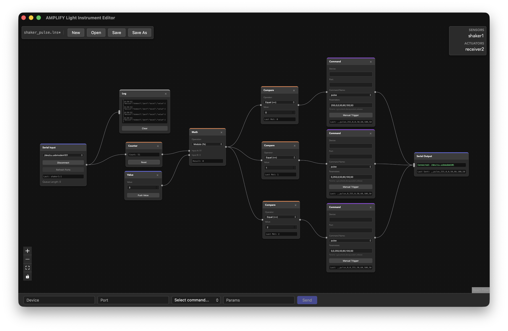

# AMPLIFY Light Instrument Editor

A node-based editor for processing sensor data from AMPLIFY light instruments
and controlling LED strips in real-time. Built with Tauri, React, and Rust,
this application provides a Blender-like interface for creating complex data
processing pipelines.



### Purpose

The AMPLIFY Light Instrument Editor is designed to bridge the gap between
the AMPLIFY Light Instruments and expressive lighting effects. It allows users
to:

- **Receive** data from multiple serial devices using a structured `"device,port,value"` protocol.
- **Process** signals using a vast library of nodes including filters (Smooth, Moving Average, Median), math operations, and logic gates.
- **Visualize** live data streams through real-time graphs and logging nodes.
- **Control** LED controllers by mapping sensor triggers to animation commands (e.g., `set`, `pulse`, `rainbow`).

### Documentation

For a comprehensive guide on how to use the editor, including detailed node
descriptions and example setups, please refer to the
**[User Guide (PDF)](user_guide/user_guide.pdf)**.

### Development

To launch the application in development mode:

```bash
npm install
npm run tauri dev
```

To build a production executable:

```bash
npm run tauri build
```
